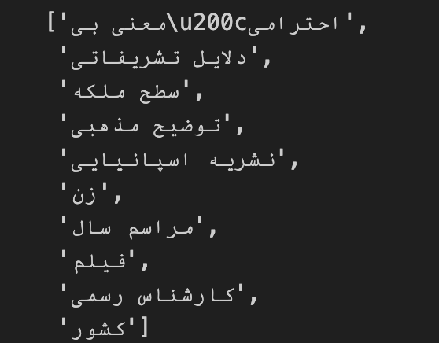

# Persian Keyphrase Extraction with EmbedRank

## Overview

This repository contains the implementation of a Persian keyphrase extraction system using the EmbedRank method. The EmbedRank algorithm has been adapted and customized for the Persian language. The system includes trained models for Persian sentence embedding and part-of-speech (POS) tagging, utilizing the Hazm library.

## Features

- **EmbedRank Method:** The system employs the [EmbedRank algorithm for keyphrase extraction](https://github.com/swisscom/ai-research-keyphrase-extraction), adapted and optimized for the Persian language.

- **Trained Models:**
  - **Persian Sentence Embedding:** Pre-trained models for generating embeddings from Persian sentences, capturing semantic features. You can download this pretrained sentence embedding model from this [link](https://mega.nz/file/WzR0QChY#J1nG-HGq0UJP69VMY8I1YGl_MfEAFCo5iizpjofA4OY). 
  - **Persian POS Tagger:** Pre-trained models for part-of-speech tagging specifically designed for Persian text. you can download this pretrained POS tagger model from this [link](https://drive.google.com/file/d/1Q3JK4NVUC2t5QT63aDiVrCRBV225E_B3/edit)

- **Hazm Library Usage Example:** This implementation serves as a sample of Hazm library usage and is featured in the [Hazm documentation](https://www.roshan-ai.ir/hazm/docs/content/samples/keyword_extraction.html#_7). Feel free to open the link and view full persian documentation about this implemention.

## Implementation Details

- **Sentence Embedding Training:** The Persian sentence embedding model is trained to capture contextual information and semantic features specific to the Persian language to find relevant phrases.

- **POS Tagger Training:** The Persian POS tagger is trained for accurate part-of-speech tagging in Persian text to convert sequence of words to decent candidate phrases that can be selected as keyphrases.

- **EmbedRank Customization:** EmbedRank algorithm is adapted and fine-tuned for optimal keyphrase extraction from Persian documents.
